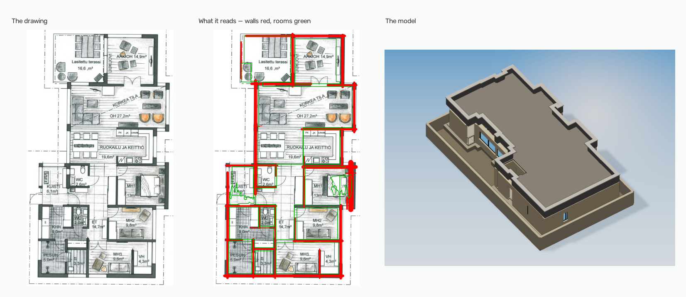

# PlanTo3D

Turns a 2D architectural floor plan into a measured 3D model of the building.

Feed it a PDF, PNG or JPEG of a floor plan and it returns a `.glb` you can
open in any 3D viewer, along with plan, elevation and aerial views. Walls,
rooms, doors, windows, stairs, gardens and paving are read off the drawing,
and each room is identified by what it is for rather than by any text
printed on it -- most plans print none.

Where the drawing states its own size, in printed room dimensions or a
floor area, that is read and used after being checked against the
geometry. Where it does not, the size is inferred from door widths and
wall thickness, and the pipeline says out loud that it is estimating: the
proportions are right and the absolute figure is a judgement.



*A sheet from CubiCasa5K, the walls and rooms read off it, and the model
built from them. Nothing in the middle panel is hand-corrected.*

## What it does

```
floor plan  ──▶  segmentation  ──▶  geometry  ──▶  calibration  ──▶  3D model
  PDF/PNG        U-Net+ResNet34      walls,          scale from       .glb +
                 or classical        rooms,          the drawing's    six views
                 baseline            openings        own dimensions
```

A U-Net with a ResNet34 encoder labels every pixel as wall, room, door,
window or background. Classical computer vision turns that mask into
measurable geometry — wall centrelines, room polygons, openings bound to the
walls they interrupt. OCR reads the printed room names and dimensions, which
give both the real-world scale and what each space is for. The result is
extruded into a stacked, materialled model.

## Results

Every figure below was produced by running the script named beside it, on
the checkpoint that is actually installed. Nothing here is quoted from a
training log.

### What the segmenter reads

`scripts/class_accuracy.py`, the 60 held-out test plans at their own resolution,
against correctly rasterised annotations:

| Class | Share of page | IoU | Recall |
| --- | --- | --- | --- |
| background | 40.40% | 0.953 | 97.0% |
| bedroom | 10.45% | 0.854 | 91.3% |
| kitchen | 5.38% | 0.770 | 82.7% |
| outdoor | 5.54% | 0.758 | 89.1% |
| bath | 3.18% | 0.758 | 87.1% |
| room | 20.87% | 0.741 | 79.7% |
| circulation | 4.23% | 0.680 | 86.0% |
| **wall** | 6.44% | **0.660** | 88.6% |
| storage | 2.98% | 0.600 | 75.4% |
| door | 0.71% | 0.545 | 75.9% |
| **window** | 1.30% | **0.223** | 27.3% |

Wall matters most, since walls drive the whole reconstruction. Window is the
weakest thing in the project, and the reason is a bug rather than scarcity:
the converter that turns CubiCasa's SVGs into training masks drew every window
as its outline and labelled the glass wall. The installed checkpoint learned
exactly that — it covers 27% of each window and builds wall through the rest.
The converter is fixed; a retrain on the corrected masks has not yet been run.
`docs/AUDIT.md`, "Every window in the masks was hollow", has the measurements.

These are pooled over pixels. The script also prints a per-sheet median,
which is far kinder (bath reads 0.93 rather than 0.76); the pooled figure
is quoted everywhere because it is the less flattering of the two.

### What the geometry makes of it

| What | Script | Result |
| --- | --- | --- |
| Plans right on every check at once | `output_scorecard.py`, 60 | **11/60** (18%) |
| Wall coverage — annotated wall that gets built | `wall_accuracy.py`, 60 | **97.9%** median |
| Wall agreement — built wall that really is wall | `wall_accuracy.py`, 60 | **79.9%** median |
| Sheets split into the right number of plans | `split_accuracy.py`, 60 | **57/60**, 100% precision, 73% recall |
| Scale within a fifth of true | `scale_accuracy.py`, 60 | **44/60**, 12.9% median error |
| Open-to-sky spaces, pixel IoU | `open_air_accuracy.py`, 52 | **75.4%** |
| Windows found, as detection | `window_detection_accuracy.py`, 59 plans, 422 windows | **87.7%** found, 84.5% precision |
| Tests | `pytest` | **920** |

Every row is measured on plans from CubiCasa's held-out test
split, listed in `data/cubicasa_test60.txt`, against annotations rasterised
correctly. An earlier sample turned out to be mostly training data, and the
earlier masks drew every window hollow; `docs/AUDIT.md` explains both.

Window detection is reported separately from window IoU on purpose. A
window is a strip, and what matters downstream is whether an opening ends
up on the right wall in roughly the right place, not whether the pixels
line up. Measured that way it finds 88% of them, and 85% of what it calls a
window is one -- far better than the 0.223 pixel score suggests. The gap is
how much of each window it paints: trained on outlines, it covers 27% of the
glass and splits a window into pieces, 727 of them for 422 windows.

### Does it generalise?

Honestly: not proven. Every number above comes from Finnish apartment
plans, plus one Indian villa used as a control. That is the single
biggest qualification on the whole project and `docs/AUDIT.md` says so at
the top.

What can be tested cheaply is the *rendering* of a drawing rather than
its origin. `scripts/convention_stress.py` redraws the sheets we have the
way other conventions draw them, holding the annotation fixed so the
ground truth stays valid. 15 held-out test plans, against correctly rasterised
annotations:

| Convention | Wall IoU | vs as drawn |
| --- | --- | --- |
| Solid poché walls | 0.761 | +0.022 |
| **As drawn** | **0.739** | — |
| Photocopied, toned paper, finer pen | 0.726–0.735 | within 0.013 |
| Heavier pen | 0.703 | −0.036 |
| Hatched walls | 0.662 | −0.077 |
| **Outline walls** | **0.567** | **−0.172** |
| Reversed print, fed straight to the model | 0.005 | ingest turns it the right way up first |

The model is not fragile to scan quality: paper tone and pen weight cost
little, and hatched walls are still read as walls. Outline-drawn walls are
the one real gap, and the training augmentation includes them for the next
run. This script feeds each redrawn sheet straight to the segmenter, so a
reversed print scores near zero here; the pipeline's ingest step detects a
reversed print and turns it the right way up before the model sees it.

A simulated convention is not a second corpus. It is a lower bound on the
damage, and what it narrows is *which* corpus would be worth getting.

### Geometric accuracy

On a three-storey reference set the model comes out 77 × 51 ft on plan and
30.5 ft tall — three 9 ft storeys, a slab and a parapet — consistent with the
3,050 sq ft construction area printed on the sheet. All three floors
independently agree on scale to within 6%.

## Scale without dimensions

Most plans do not print room dimensions. Rather than refuse them, scale falls
back through progressively weaker references, each still grounded in the
drawing:

| Source | Median error | Bias | Used on |
| --- | --- | --- | --- |
| Printed dimensions or area | — | — | checked against the geometry first |
| **Door widths** | **8.7%** | **−1.9%** | 38 of 60 plans |
| Wall thickness | 16.7% | −14.3% | 22 of 60 plans |
| Drafting ratio | — | — | last resort, never needed on this corpus |

`scripts/scale_accuracy.py` over the 60 held-out test plans: 12.9% median
error overall, 44 within a fifth of true. Plans fall back to wall thickness
when the segmenter finds too few doors — on those plans it detects a median
of 2 of the 6.5 the annotation draws — which `docs/AUDIT.md` measures.

Doors work because they are the most standardised element in a building: a
house is mostly interior doors around 2'6", whatever the drafting conventions
or the language on the sheet. Wall thickness does not travel nearly as well
-- it reads about 14% low on the held-out Finnish apartments and 6% high on
the Indian control -- which is why the constant behind it is deliberately left alone.
See the trap noted in `docs/AUDIT.md`.

Anything printed is **gated**: a figure read by OCR is used only when it
agrees with the geometric estimate, because one misread character would
otherwise resize the whole building.

## What you choose, and what the drawing decides

The drawing fixes the geometry: where the walls are, how the rooms divide,
where the doors and windows sit. None of that is a choice — the output is
meant to be the plan, in three dimensions.

What a drawing never says is what the building is made of, what hour it is
seen at, or whether there is a garden. That is five choices:

| | Options | What it changes |
| --- | --- | --- |
| Style | modern, luxury, traditional, minimalist | What the building is clad in |
| Colour | light, dark, warm | How light and how warm that reading is |
| Time | day, sunset, night | The light, the sky and the shadows |
| Landscaping | none, basic, premium | Plot, planting, boundary wall |
| Creativity | strict, balanced, creative | How far the photoreal pass may stray |

Style and colour compose rather than enumerate: four characters times three
tones would be twelve palettes to write and keep consistent, so the style
says what the building is made of and the tone says how light and how warm
to take it. The tone is applied in HLS, so a brick stays recognisably brick
when it darkens instead of turning grey.

An earlier version offered a colour picker per surface — ten of them. That
is a spreadsheet rather than a choice: it asks someone to design a palette
when what they wanted was a house that looks a particular way.

```bash
python scripts/run_pipeline.py plan.pdf output --checkpoint models/unet_cubicasa.pt
```

`notebooks/design_on_colab.ipynb` runs the whole thing on a Colab GPU with
these as form fields, including the photoreal pass.

## Run it without installing anything

`notebooks/run_on_colab.ipynb` does the whole thing on a Colab GPU: upload
a plan, choose how it should look, and get two different kinds of thing:
the **model** with its six views and detection overlays, which is measured
and traces back to your drawing, and a **diffusion-dressed impression**,
which is neither. The notebook keeps them apart and says which is which.

[Open it in Colab](https://colab.research.google.com/github/priyanshsoni096-blip/PlanTo3D/blob/main/notebooks/run_on_colab.ipynb)

It needs the trained checkpoint, which is too large for the repository.
Keep it on Drive at `MyDrive/planto3d/unet_cubicasa.pt` or upload it when
the notebook asks.

The other notebooks are narrower: `train_on_colab.ipynb` trains the
segmenter, `photoreal_on_colab.ipynb` runs the diffusion pass alone against
a depth guide you already have.

## Installation

Needs Python 3.11+, plus [Poppler](https://poppler.freedesktop.org/) for PDF
rasterization and [Tesseract](https://github.com/tesseract-ocr/tesseract) for
OCR. Both are found automatically wherever they are installed.

```bash
python -m venv .venv
.venv/Scripts/activate          # source .venv/bin/activate on Unix
pip install -e ".[dev]"
```

The trained segmenter additionally needs `pip install -e ".[ml]"`. Without a
checkpoint the classical baseline is used instead.

## Usage

To see the whole thing work once, on one plan, end to end:

```bash
python scripts/demo.py
```

That reads a demo plan, builds the model, renders it with both renderers and
prints where everything landed, one numbered stage at a time. `--fast` skips
the Blender pass, which is roughly three quarters of the run; `--plan` points
it at a drawing of your own and `--lighting` picks the hour.

Every other script here does one stage or measures one thing. This is the
single-stage-at-a-time entry point:

```bash
python scripts/run_pipeline.py plan.pdf output --checkpoint models/unet.pt
```

`plan.pdf` may be a PDF, a single image, or a directory of images — one per
storey, in filename order. Writes `house.glb`, six rendered views and a
detection overlay per floor.

### Correcting what the reader got wrong

Room labels decide what gets built — railings, paving, planting, open-to-sky
treatment, floor finishes — and they come from OCR, which on real drawings
frequently reads nothing. See what was found, then fix it:

```bash
python scripts/correct_and_build.py plan.pdf output --checkpoint models/unet.pt --list
python scripts/correct_and_build.py plan.pdf output --checkpoint models/unet.pt --correct 1:5=open
```

`--correct FLOOR:ROOM=CATEGORY` uses the numbers `--list` prints. A
correction is simply a room label that did not come from OCR, so nothing
downstream has to know where it came from.

Corrections can be saved and reused, so a plan is annotated once rather than
once per run:

```bash
python scripts/correct_and_build.py plan.pdf output --correct 1:5=open --save-corrections plan.txt
python scripts/correct_and_build.py plan.pdf output --corrections plan.txt
```

A sheet carrying several plans is sometimes read as one, or a single plan is
occasionally cut in two. `--split N` and `--no-split` settle it by hand:

```bash
python scripts/correct_and_build.py plan.pdf output --split 2    # force N plans
python scripts/correct_and_build.py plan.pdf output --no-split   # keep it whole
```

`--split` uses the dividing line the splitter already found and only skips
the checks that reject it; it cannot invent a division where none was
proposed, and raises rather than guess when that happens.

Every inferred scale rests on an assumed standard element — a 2'6" door, a
9" wall — that does not hold on every building. `--scale-room` sidesteps
that: state one room's real size and the whole model is sized from it.

```bash
python scripts/correct_and_build.py plan.pdf output --checkpoint models/unet.pt --scale-room 1:5=12x10
```

`--scale-room FLOOR:ROOM=WxH` takes the same floor/room numbering `--list`
prints, with W and H the room's real width and height in feet. Because the
stated scale changes which small regions clear the room-size filter, the
sheet is read a second time at that scale, and room numbers can shift as a
result — combine `--scale-room` with `--correct` or `--corrections` and aim
the correction using the listing printed *after* the re-read, not one from
an earlier, unscaled run.

### Checking against a real building

Every other score here is against an annotator's drawing. To compare the
model with a building you can measure, write the measurements in the same
syntax the flags use — `overall=WxD` for the ground-floor outline and
`FLOOR:ROOM=WxH` per room, in feet — and keep the file somewhere git
ignores:

```bash
python scripts/reference_check.py plan.pdf data/soni_residence/truth.txt --checkpoint models/unet_cubicasa.pt
```

It prints each item's real and modelled size and marks it against the
spec's gate: within 5% overall, within 10% per room. Take room numbers from
a `--list` run on the same plan.

### Correcting window annotations for retraining

Windows are the weakest thing the model reads, and the evidence points at
the training data. To improve it, export the model's own window predictions
from **training** plans and correct them in [LabelMe](https://github.com/wkentaro/labelme)
rather than drawing from scratch:

```bash
python scripts/export_windows.py <cubicasa root> <cubicasa root>/train.txt --checkpoint models/unet_cubicasa.pt --limit 30
python scripts/export_windows.py <cubicasa root> <cubicasa root>/train.txt --status
```

Each plan gets a `F1_scaled.json` beside its image. Open the folder in
LabelMe, fix the `window` rectangles, tick **reviewed**, save. Training uses
only reviewed files, never overwrites one on re-export, and refuses the
held-out test split outright.

Training runs on Colab against its own download of the dataset, so the
corrections travel as a zip. Bundle them, put the zip on Drive at
`MyDrive/planto3d/window_labels.zip`, and section 3b of
`notebooks/train_on_colab.ipynb` unpacks them before training:

```bash
python scripts/export_windows.py <cubicasa root> <cubicasa root>/train.txt --bundle window_labels.zip
```

### Deterministic rendering

`preview.py`'s numpy rasterizer is what every script above uses, and it
is fast and plain. `planto3d/blender_render.py` is the slower, prettier
alternative: real materials, soft shadows and global illumination via
headless Blender Cycles, with no generative step, so every surface in
the image is one the drawing supports rather than an invention. It needs
the `render` extra, which pulls a 659 MB `bpy` install:

```bash
pip install -e ".[render]"
python scripts/render_blender.py house.glb output
python scripts/render_blender.py house.glb output --lighting dusk
```

`--lighting` takes the same hour names `style.LIGHTING_PRESETS` defines
-- `midday`, `golden hour`, `overcast`, `dusk` -- so the Blender path and
`preview.py` can be pointed at the same hour and compared frame for
frame.

Reach for it over `preview.py` when the image itself needs to stand as
evidence -- a client-facing render, a figure in a report -- rather than
just a quick look at what got built; for that quick look, `preview.py`'s
six views in a couple of seconds are the better tool.

## Training

[`notebooks/train_on_colab.ipynb`](notebooks/train_on_colab.ipynb) trains the
segmenter on a free Colab GPU: roughly 6 minutes per epoch on a T4, about 80
minutes for the full run. It verifies the annotation mapping against real
samples before spending GPU time, since a wrong mapping trains a model that
looks broken for reasons unrelated to training.

## Photoreal pass

[`notebooks/photoreal_on_colab.ipynb`](notebooks/photoreal_on_colab.ipynb)
runs the model through depth-conditioned ControlNet to produce an
architectural visualization.

This stage **invents rather than measures**. Everything before it traces back
to the drawing; this adds stone coursing, lighting for whichever hour you
chose and reflections that no floor plan contains. ControlNet pins the
invention to our real depth and edges, so the result is this house rendered
convincingly rather than a plausible house that resembles it — but it is an
impression of the design, not a measurement of it.

## What it recognises

Room labels drive geometry, not just colour:

| Category | Examples | Effect |
| --- | --- | --- |
| water | pool, jacuzzi, water body | sunk into the ground |
| void | double height, OTS, atrium, shaft | removes the floor above |
| lawn | landscape, terrace garden, planter | planted cover |
| paving | parking, car porch, courtyard, verandah | hard landscaping |
| open | balcony, terrace, deck | railed edge |
| stairs | staircase, steps, and the bare "UP" mark | a flight climbing one storey |
| wet | bathroom, toilet, wash, utility, scullery | tiled floor |
| dome | dome, cupola, rotunda, shikhara, gumbad | half ellipsoid on a drum |
| pitched | sloping, gable, hip, mansard roof | ridged roof, tiled |
| glazed | glass roof, skylight, conservatory, orangery | slanting glazing |
| tank | overhead tank, water tank | tank on legs, on the roof |
| chimney | chimney, flue stack | brick stack |
| tower | turret, minaret, belvedere, spire | capped tower |
| canopy | portico, car canopy, awning, chajja | thin projecting cover |
| ramp | ramp, vehicle ramp, wheelchair ramp | sloped slab at about 1:12 |

Over 450 keywords in all, covering what a plan can carry rather than what one
drawing set happened to use: loggia, lanai, breezeway and portico alongside
balcony and terrace; lightwells, airwells and ventilation courts alongside
double-height; motor courts and forecourts alongside driveways.

The last eight categories are the building's own form rather than its
floors. Domes, pitched roofs, glazing, tanks, chimneys and towers stand on
the roof; **canopies and ramps belong to the storey they are drawn on** -- a
porch over the front door is at first floor soffit level, and moving it to
the roof would leave the door uncovered.

South Asian and Middle Eastern terms are included — otla, osari, baramda,
chabutra, jharokha, baithak, majlis, diwan, mumty, chajja — because these
drawings use them and no published floor-plan glossary covers them.

Interior floors are finished by purpose — timber where a house is lived in,
tile where it is worked in, stone through circulation.

## Limitations

- **Windows are the weakest thing here.** 88% of them are found and 85% of
  what is reported is real, but the installed model was trained on hollow
  window labels: it paints 27% of each window, builds wall through the rest,
  and pixel IoU is 0.223. The label bug is fixed; the retrain is not yet run. Four ways of fixing it with more pixels have been tried and
  measured, and none paid; `docs/AUDIT.md` records all four so they are
  not tried a fifth time.
- **Absolute size is inferred unless the drawing states it.** Over 60
  held-out plans, 44 land within a fifth of true at a 12.9% median error,
  biased low. Proportions are sound; the absolute figure is an estimate,
  and the output says which it is.
- **Sheets holding several plans are split on 57 of 60**, at 100%
  precision and 73% recall. What it still misses is terraced blocks whose
  units share a party wall, where there is no gutter to find at any
  threshold. Feeding one storey per image remains the certain route.
- **Only two and a half drafting conventions have ever been tested.** This
  is the biggest qualification on every number in this file. Eight
  conventions were simulated and the model held up on all but
  outline-drawn walls, but a simulation is not a second corpus.
- Only axis-aligned walls are recovered. Diagonal walls are erased by the
  orientation filters, which is acceptable for the rectilinear plans this
  targets and wrong for anything else.
- Multi-storey alignment assumes the sheets share a drawing frame, which is
  true within one drawing set and not across separately drafted plans.

## Picking the work back up

[`docs/STATE.md`](docs/STATE.md) records where the project stands, what is
left to run, the limitations that are understood rather than mysterious, and
the handful of things that cost real time to discover and would be easy to
undo by accident.

## Layout

```
planto3d/     the pipeline: ingest, segment, extract, calibrate, extrude
training/     dataset, metrics and training loop for the segmenter
notebooks/    Colab notebooks for training and the photoreal pass
scripts/      command-line entry points; demo.py runs the lot once
tests/        920 tests
docs/         design spec and implementation plan
```

## Licence

Not currently licensed for reuse.
