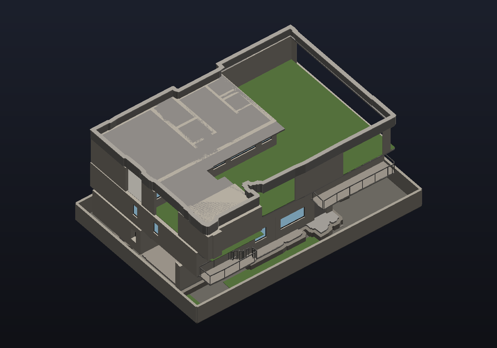

# PlanTo3D

Turns a 2D architectural floor plan into a measured 3D model of the building.

Feed it a PDF, PNG or JPEG of a floor plan and it returns a `.glb` you can
open in any 3D viewer, along with plan, elevation and aerial views. Walls,
rooms, doors, windows, stairs, gardens and paving are read off the drawing;
the scale comes from the plan's own printed dimensions, so the model is
measured in real feet rather than guessed at.



## What it does

```
floor plan  ──▶  segmentation  ──▶  geometry  ──▶  calibration  ──▶  3D model
  PDF/PNG        U-Net+ResNet34      walls,          scale from       .glb +
                 or classical        rooms,          the drawing's    six views
                 baseline            openings        own dimensions
```

A U-Net with a ResNet34 encoder labels every pixel as wall, room, door,
window or background. Classical computer vision turns that mask into
measurable geometry — wall centrelines, room polygons, openings bound to the
walls they interrupt. OCR reads the printed room names and dimensions, which
give both the real-world scale and what each space is for. The result is
extruded into a stacked, materialled model.

## Results

The segmenter was trained on [CubiCasa5K](https://github.com/CubiCasa/CubiCasa5k)
(5,000 annotated floor plans) and scored on its held-out test split:

| Metric | Score |
| --- | --- |
| Dice | 0.7577 |
| IoU | 0.6790 |
| Wall IoU | 0.7721 |
| Room IoU | 0.9299 |
| Door IoU | 0.6505 |
| Window IoU | 0.1177 |

Wall IoU is the figure that matters most, since walls drive the entire
reconstruction. Window IoU is poor for a reason worth stating: windows are
0.11% of CubiCasa's pixels, and no amount of Dice loss overcomes a 900:1
class imbalance.

### Against a classical baseline

A threshold-and-morphology baseline is included, tuned to clean CAD sheets.
On the reference drawings the trained model finds what the baseline
structurally cannot:

| | Classical | Trained U-Net |
| --- | --- | --- |
| Wall pixels | 4.2% | 6.7% |
| Room pixels | 24.9% | 54.7% |
| **Doors** | **none** | 0.6% |
| **Windows** | **none** | 0.1% |
| Rooms named | 17 | 30 |

The baseline detects no doors or windows at all — it distinguishes two grey
levels and nothing more. That gap is what makes real openings possible, so
the trained model does not merely score better; it unlocks geometry the
baseline cannot produce.

### Does it generalise?

The geometry layer's constants were measured from one drawing set, so
`scripts/generalisation_test.py` runs the stages over CubiCasa samples
drafted by other people in other conventions. Predictions were recorded
before the run; all three held.

| | Trained U-Net | Classical baseline | Colour signals |
| --- | --- | --- | --- |
| Usable geometry | **12 of 12** | — | — |
| Mean wall pixels | 7.2% | **0.0%** | — |
| Mean walls found | 31 | **1** | — |
| Found anything | — | no walls at all on 10 of 12 | windows 5/12, planting 1/12 |

Across sheets from 954×984 to 3536×1879. The trained model generalises; the
heuristics around it do not. That is the honest reading, and it is why the
segmentation model is the contribution rather than the pipeline that
consumes it.

### Geometric accuracy

On a three-storey reference set the model comes out 77 × 51 ft on plan and
30.5 ft tall — three 9 ft storeys, a slab and a parapet — consistent with the
3,050 sq ft construction area printed on the sheet. All three floors
independently agree on scale to within 6%.

## Scale without dimensions

Most plans do not print room dimensions. Rather than refuse them, scale falls
back through progressively weaker references, each still grounded in the
drawing:

| Source | Accuracy on the reference sheet |
| --- | --- |
| Printed dimensions | exact, 28.15 px/ft |
| Door widths | within 4% |
| Wall thickness | within 11% |
| Drafting ratio | within 14% |

Doors work because they are the most standardised element in a building: a
house is mostly interior doors around 2'6", whatever the drafting conventions
or the language on the sheet.

## Installation

Needs Python 3.11+, plus [Poppler](https://poppler.freedesktop.org/) for PDF
rasterization and [Tesseract](https://github.com/tesseract-ocr/tesseract) for
OCR. Both are found automatically wherever they are installed.

```bash
python -m venv .venv
.venv/Scripts/activate          # source .venv/bin/activate on Unix
pip install -e ".[dev]"
```

The trained segmenter additionally needs `pip install -e ".[ml]"`. Without a
checkpoint the classical baseline is used instead.

## Usage

```bash
python scripts/run_pipeline.py plan.pdf output --checkpoint models/unet.pt
```

`plan.pdf` may be a PDF, a single image, or a directory of images — one per
storey, in filename order. Writes `house.glb`, six rendered views and a
detection overlay per floor.

For the web interface:

```bash
python app.py
```

Upload a plan, set the storey height, and the model appears in a viewer you
can orbit. A checkpoint dropped into `models/` is picked up automatically.

## Training

[`notebooks/train_on_colab.ipynb`](notebooks/train_on_colab.ipynb) trains the
segmenter on a free Colab GPU: roughly 6 minutes per epoch on a T4, about 80
minutes for the full run. It verifies the annotation mapping against real
samples before spending GPU time, since a wrong mapping trains a model that
looks broken for reasons unrelated to training.

## Photoreal pass

[`notebooks/photoreal_on_colab.ipynb`](notebooks/photoreal_on_colab.ipynb)
runs the model through depth-conditioned ControlNet to produce an
architectural visualization.

This stage **invents rather than measures**. Everything before it traces back
to the drawing; this adds stone coursing, dusk lighting and reflections that
no floor plan contains. ControlNet pins the invention to our real depth and
edges, so the result is this house rendered convincingly rather than a
plausible house that resembles it — but it is an impression of the design,
not a measurement of it.

## What it recognises

Room labels drive geometry, not just colour:

| Category | Examples | Effect |
| --- | --- | --- |
| water | pool, jacuzzi, water body | sunk into the ground |
| void | double height, OTS, atrium, shaft | removes the floor above |
| lawn | landscape, terrace garden, planter | planted cover |
| paving | parking, car porch, courtyard, verandah | hard landscaping |
| open | balcony, terrace, deck | railed edge |
| stairs | staircase, steps, and the bare "UP" mark | a flight climbing one storey |
| wet | bathroom, toilet, wash, utility, scullery | tiled floor |

335 keywords in all, covering what a plan can carry rather than what one
drawing set happened to use: loggia, lanai, breezeway and portico alongside
balcony and terrace; lightwells, airwells and ventilation courts alongside
double-height; motor courts and forecourts alongside driveways.

South Asian and Middle Eastern terms are included — otla, osari, baramda,
chabutra, jharokha, baithak, majlis, diwan, mumty, chajja — because these
drawings use them and no published floor-plan glossary covers them.

Interior floors are finished by purpose — timber where a house is lived in,
tile where it is worked in, stone through circulation.

## Limitations

- Targets clean, digital floor plans. Photographs and heavily compressed
  scans produce poor results, because the segmentation is only as good as
  its input.
- Windows and planting are read partly from the drawing's colour — cyan for
  glazing, green for planting. Greyscale plans fall back to the model, which
  is weak on both.
- Only axis-aligned walls are recovered. Diagonal walls are erased by the
  orientation filters, which is acceptable for the rectilinear plans this
  targets and wrong for anything else.
- Multi-storey alignment assumes the sheets share a drawing frame, which is
  true within one drawing set and not across separately drafted plans.

## Picking the work back up

[`docs/STATE.md`](docs/STATE.md) records where the project stands, what is
left to run, the limitations that are understood rather than mysterious, and
the handful of things that cost real time to discover and would be easy to
undo by accident.

## Layout

```
planto3d/     the pipeline: ingest, segment, extract, calibrate, extrude
training/     dataset, metrics and training loop for the segmenter
notebooks/    Colab notebooks for training and the photoreal pass
scripts/      command-line entry points
tests/        384 tests
docs/         design spec and implementation plan
```

## Licence

Not currently licensed for reuse.
